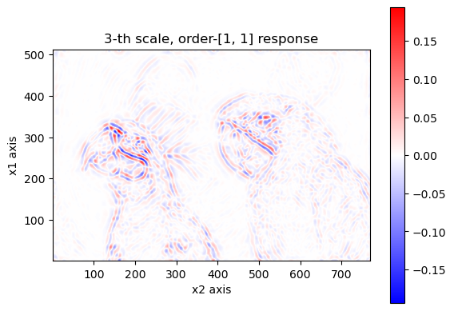

# Demo: image analysis

## Load dependencies

````julia
import RieszDSP as RZ
using LinearAlgebra

import PythonPlot as PLT # for visualization
PLT.close("all")
fig_num = 1;

import Images # for loading the image.
````

We'll use 64-bit floating point numbers. We will get a higher round-trip discrepancy if we use less precision.

````julia
T = Float64;
````

## Load image, and convert into a 2-D array

````julia
file_path = "data/kodim23.png"
img = Images.load(file_path)
gray_img = Images.Gray.(img)
y = convert(Array{T}, gray_img); # This is the image, stored as a 2-D array.
````

## Set specifications, then apply higher-order Riesz-wavelet transform on y

````julia
#specifications
order = 2
N_scales = round(Int, log2( maximum(size(y))))

#forward transform.
WRY, residual, a_array = RZ.rieszwaveletanalysis(
    y, N_scales, order,
)
println("contents of a_array:")
display(a_array)
println()
````

````
contents of a_array:


````

WRY is a nested array that contains the Riesz-wavelet response of y.

Given a l and j, WRY[l][j] is the response for the l-th Riesz order state, j-th wavelet analysis subband.
The set of all Riesz order states is stored in `a_array`. The residual is the portion of the input that was excluded from the Riesz-wavelet transform. We need this if we want to do perfect reconstruction given the forward transform responses.

These two should always have the same length, which is the number of different combinations of iteration for Riesz transform for each dimension.

````julia
@assert length(a_array) == length(WRY)
````

## Visualize

````julia
#maximum intensity.
vmax = maximum(abs.(y))

#original.
PLT.figure(fig_num)
fig_num += 1
PLT.pcolormesh(
    1:size(y,2),
    size(y,1):-1:1,
    y,
    #cmap = "bwr",
    cmap = "gray",
    shading = "auto",
    vmin = zero(T),
    vmax = vmax,
)
PLT.colorbar()
PLT.axis("scaled")
PLT.xlabel("x2 axis")
PLT.ylabel("x1 axis")
PLT.title("Original input")
PLT.gcf()
````


We will just plot the 5-th scale of the wavelet subband for this example.

````julia
j = 3;
````

The first Riesz-order state, subband j.

````julia
l = 1
println("Riesz order state: ", a_array[l])

rsp = WRY[l][j]
Z = max(abs(minimum(rsp)), abs(maximum(rsp)))

PLT.figure(fig_num)
fig_num += 1
PLT.pcolormesh(
    1:size(rsp,2),
    size(rsp,1):-1:1,
    rsp,
    cmap = "bwr",
    #cmap = "gray",
    shading = "auto",
    vmin = -Z,
    vmax = Z,
)
PLT.colorbar()
PLT.axis("scaled")
PLT.xlabel("x2 axis")
PLT.ylabel("x1 axis")
PLT.title("$j-th scale, order-$(a_array[l]) response")
PLT.gcf()
````


The second Riesz-order state, subband j.

````julia
l = 2
println("Riesz order state: ", a_array[l])

rsp = WRY[l][j]
Z = max(abs(minimum(rsp)), abs(maximum(rsp)))

PLT.figure(fig_num)
fig_num += 1
PLT.pcolormesh(
    1:size(rsp,2),
    size(rsp,1):-1:1,
    rsp,
    cmap = "bwr",
    #cmap = "gray",
    shading = "auto",
    vmin = -Z,
    vmax = Z,
)
PLT.colorbar()
PLT.axis("scaled")
PLT.xlabel("x2 axis")
PLT.ylabel("x1 axis")
PLT.title("$j-th scale, order-$(a_array[l]) response")
PLT.gcf()
````


The third Riesz-order state, subband j.

````julia
l = 3
println("Riesz order state: ", a_array[l])

rsp = WRY[l][j]
Z = max(abs(minimum(rsp)), abs(maximum(rsp)))

PLT.figure(fig_num)
fig_num += 1
PLT.pcolormesh(
    1:size(rsp,2),
    size(rsp,1):-1:1,
    rsp,
    cmap = "bwr",
    #cmap = "gray",
    shading = "auto",
    vmin = -Z,
    vmax = Z,
)
PLT.colorbar()
PLT.axis("scaled")
PLT.xlabel("x2 axis")
PLT.ylabel("x1 axis")
PLT.title("$j-th scale, order-$(a_array[l]) response")
PLT.gcf()
````


## Round-trip discrepancy
the inverse Riesz-wavelet transform first performs wavelet synthesis to gather the subband responses for each Riesz order state. Then it applies the inverse higher-order Riesz transform for each Riesz order state to combine into the filtered input. The residual is then added to the filtered input to get the original input.
Therefore, if we keep track of the `residual` portion of the input, the Riesz-wavlet transform is a perfect reconstruction transform.

````julia
y_rec, a_array2 = RZ.rieszwaveletsynthesis(WRY, residual, order)
println("Round-trip discrepancy: ", norm(y_rec - y));

nothing
````

````
Round-trip discrepancy: 1.4719882595318903e-13

````

---

*This page was generated using [Literate.jl](https://github.com/fredrikekre/Literate.jl).*

